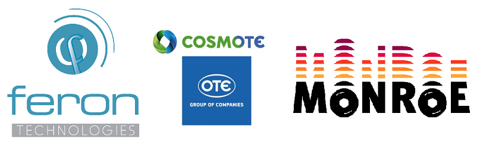

## Welcome to the _movement_ project code repository.

This repository hosts the outcomes of project MOVEMENT, a project developing open source extensions and experiments for the [EU H2020 MONROE Platform](https://www.monroe-project.eu/), as part of Open Call 1. MOVEMENT is carried out by [Feron Technologies P.C.](http://www.feron-tech.com) and [COSMOTE/OTE Group](http://www.comsote.gr).
The repository contains a set of sub-projects/experiments for measuring the quality of live or experimental mobile data networks (3G/4G/4G+) including support for WiFi technologies. These experiments may be executed either at remote MONROE nodes or locally at any linux-based host equipped with mobile broadband devices (e.g. Wi-Fi/4G USB dongle, Mi-Fi, etc.).

### List of software extensions
- Mobile network **benchmarking** based on:
  - Popular/widely-used data tests:
	- ping
	- iperf3 (direct, reverse)
	- speedtest (latency, download and upload speed)
	- HTTP file transfer (upload/download)
  - Video Streaming Quality for Youtube
  - VoIP Quality (upcoming)
- **WiFi/Offloading** experiments:
  - Test WiFi quality
  - 4G Offloading through Wi-Fi (upcoming)

