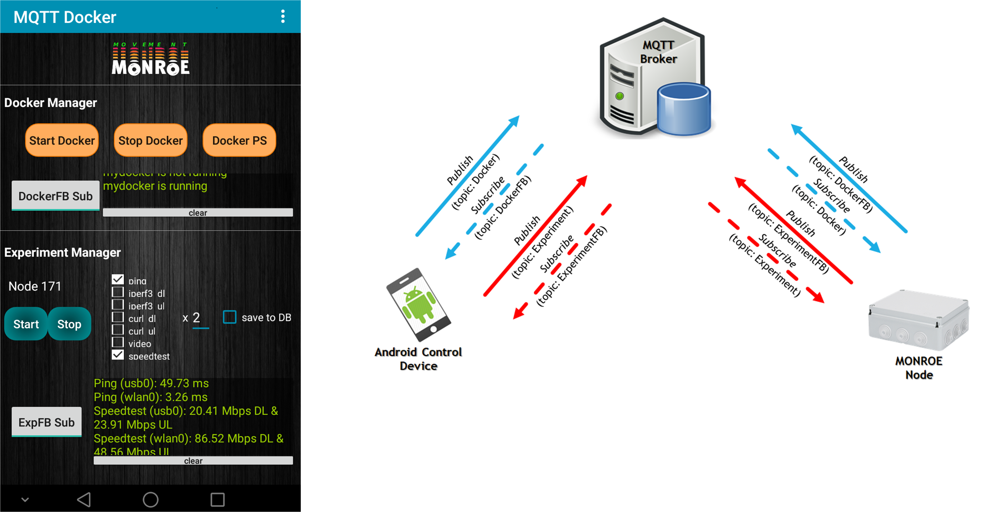

## Manage MONROE Experiments through MQTT-based Android App

### Prerequisites
* Android app _monroe_experiment_mgr.apk_ installed in an android device (see 'Android App' subfolder)
* MQTT broker installed in a server (e.g. _Eclipse Mosquitto_)
* MQTT subscription programs running on MONROE node (see 'Node Files' subfolder)
* MQTT-based docker image pulled on MONROE node (e.g. _ferontech/bench-node-mqtt_)
* (optional) MongoDB installed in a server

The setup is shown in the following Figure.

### MQTT Topics
* _Docker_ ("monroe/_nodeid_/docker"): messages for docker management (i.e. run, ps, stop)
  * Android device: publish
  * MONROE node: subscribe
* _DockerFB_ ("monroe/_nodeid_/dockerfb"): docker feedback messages
  * Android device: subscribe
  * MONROE node: publish
* _Experiment_ ("monroe/_nodeid_/experiment"): messages for experiment management (i.e. "start:_nrounds_:_test_list_:_save_db_, e.g. "start:2:ping,iperf3_ul:yes" to start 2 rounds ping, iperf3_ul tests and save to mongoDB)
  * Android device: publish
  * MONROE node: subscribe
* _ExperimentFB_ ("monroe/_nodeid_/experimentfb"): experiment feddback messages
  * Android device: subscribe
  * MONROE node: publish
