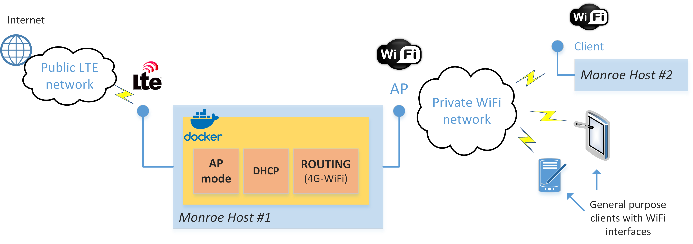

### Setting up a MONROE Development Node to Work as a 4G-WiFi Router

#### Introduction
This sub-project aims at turning a MONROE Development Node to a 4G-WiFi router using the existing hardware.
This enables WiFi offloading experimentation reflecting scenarios where a bunch of users are served through a WiFi Access Point (AP) and the AP is provided connectivity using a 4G link. Such scenarios could occur in buses/trains on the move providing Internet Connectivity to their customers, or at remote areas where networks are deployed on demand. The idea is to investigate if the offloading configuration is better/worse than allowing each user to enjoy a direct 4G connection (if possible).
The implementation of 4G-WiFi routing requires two steps:
* Enabling MONROE to operate as WiFi AP using its internal Wi-Fi card: for this we will rely on the ```hostapd``` package which allows (if it's possible) to configure a WiFi card to operate in AP mode. In addition, a DHCP service should be enabled to assign dynamic IPs to the WiFi clients. In our implementation we use the ```dnsmasq``` package, but other packages may also be used.
* Routing WiFi traffic through one of the installed 4G modems: for this we add simple ip table rules to forward traffic to/from the relevant interfaces. An example is provided below assuming that ```wlan0``` is the WiFi interface and ```usb0``` the 4G interface:

```
iptables -t nat -A POSTROUTING -o usb0 -j MASQUERADE
iptables -A FORWARD -i usb0 -o wlan0 -m state --state RELATED,ESTABLISHED -j ACCEPT
iptables -A FORWARD -i wlan0 -o usb0 -j ACCEPT
```


#### Prepare & Build an all-in-one image
##### BASE
The new image is based on the MONROE base image.
##### Pre-requisites & Packages
Initially, the required packages and dependencies not included already in the base image are installed.
```
RUN apt-get update && apt-get install --no-install-recommends -y \
build-essential \
pkg-config \
libnl-3-dev libnl-genl-3-dev libssl-dev \
dnsmasq \
&& apt-get clean
```
##### hostapd
Notice that in the previous snippet the ```hostapd``` package is not installed, because the current repo contains an older version and we prefer to build the latest version from source. The newer the version the more WiFi functionalities are supported (e.g. newer 802.11 versions such as AC, AX, automatic channel selection, etc.). Instructions for getting and compiling the ```hostapd``` package may be found in [here](https://wireless.wiki.kernel.org/en/users/documentation/hostapd). In short the following snippet prepares a fully working and pre-configured ```hostapd``` environment, by downloading, configuring and compiling the selected version.
```
RUN wget https://w1.fi/releases/hostapd-2.6.tar.gz
RUN tar xvzf hostapd-2.6.tar.gz
WORKDIR /hostapd-2.6/hostapd/

RUN cp /home/hostapd_build_config.bk .config
RUN cp /home/hostapd.conf ./hostapd.conf
RUN make clean && make
```
Crucial to the successful configuration and operation are the two provided files ```hostapd_build_config.bk``` and ```hostapd.conf```.
The former provides a tested configuration for successful package compilation. The latter includes the WiFi AP operation capabilities, i.e.:
* the mode (B/G, A, N, AC)
* the channel (fixed or dynamic based on ACS)
* transmission parameters for advanced modes (bandwidth, guard interval, etc.)
* the authentication information (SSID, WPA2 key)

##### DHCP
To operate as AP the respect wi-fi interface (e.g ```wlan0```) should be assigned a static IP address, for example ```10.0.0.1/24```, so the ```/etc/networt/interfaces``` file should be edited accordingly.
The final step is the provision of a configuration file for the ```DNSmasq``` service. This includes parameters such as:
* the AP interface (e.g. ```wlan0```);
* the DHCP pool from which the users will be assigned IPs (e.g. ```10.0.0.2-10.0.0.10```);
* the DHCP lease times, etc.

A test-file is also provided:
```
RUN cp /home/dnsmasq.conf /etc/dnsmasq.conf
```

##### Initialization
At the container start-up the following actions are performed:
* ```DNSmasq``` service is loaded;
* Routing rules are applied;
* ```hostapd``` is loaded.

These are done through the entrypoint command: ```ENTRYPOINT service dnsmasq restart && /home/routing.sh && ./hostapd ./hostapd.conf && /bin/bash```

#### Load the container
Assuming that ```monroeap``` is the name of the built image, we should run:
```
docker run --rm -it --name monroeapcn --privileged --network=host monroeap
```
The functionality could be tested with any WiFi client, e.g. a smartphone or another MONROE node.
