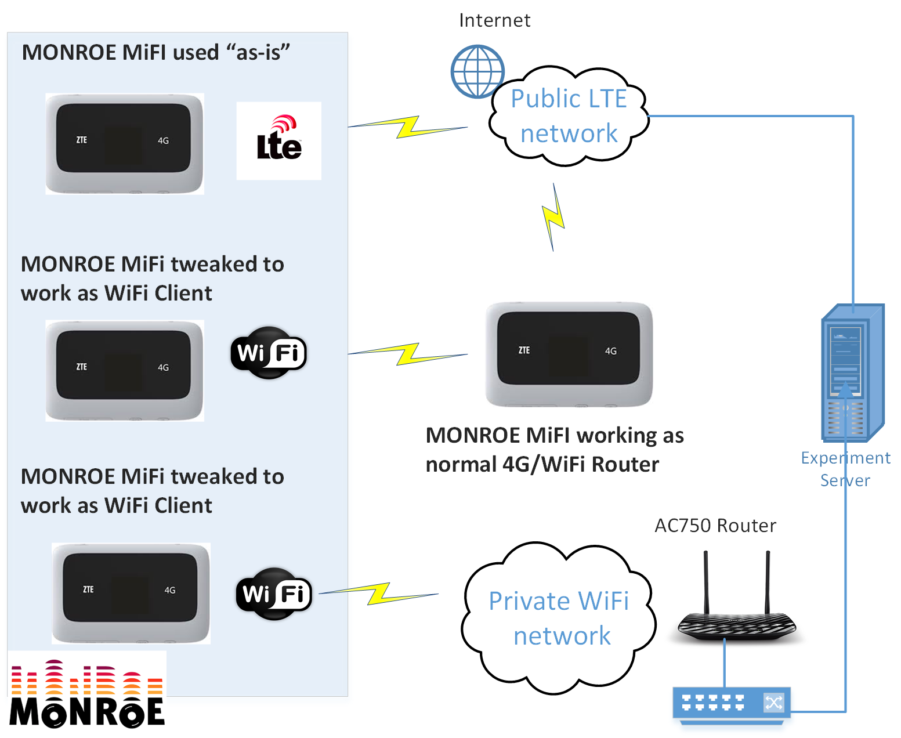

## 4G-WiFi Offloading Experiments using MONROE Nodes equipped with ZTE MF910 devices
This sub-project aims at enabling WiFi offloading experimentation in order to be compared with direct 4G connection (if possible).

### Prerequisites
* MONROE node with ZTE MF910 MiFi as a WiFi offloading node (AP/router)
* MONROE node with ZTE MF910 MiFi as a WiFi client
* MONROE node with ZTE MF910 MiFi as a 4G user (for comparison)

### Implementation
The implementation of 4G-WiFi offloading requires two steps:
* Enabling a MONROE node to operate as WiFi AP (offloading node) using its ZTE MF910 MiFi: default wifi mode of ZTE modem should not be disabled, ssid and password should be configured via web interface (_http://192.168.xx.1/_), DNS should be configured via adb commands (edit _/etc/resolv.conf_ in ZTE MF910 MiFi Android modem).
* Enabling a MONROE node to operate as WiFi client using its ZTE MF910 MiFi (which is actually an Android-device) via adb commands:
  * _mifi_zte_mf910_as_wifi_client.sh_ performs this operation (_/etc/wpa_supplicant.conf_ should be edited in ZTE MF910 MiFi Android modem): log in, switch to android mode, enable wifi, get IP though wpa_supplicant, forward traffic.
  * if the sequence of ZTE MF910 MiFi needs to be specific, ykush could be used (e.g. ```sudo ykushcmd -u 1 ```).

The experimental setup is shown in the following Figure.

 
